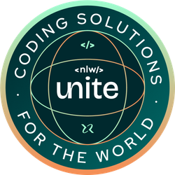

<div align="center" >
  
</div>
<br>

# Pass-in
Aplicação para a gestão e organização de participantes em eventos.
<br>
Este dashboard permite que seja possível que um adminstrador cadastre um evento e consiga abrir uma página pública para que usuários realizem seus check-ins.

## Requisitos

### Requisitos funcionais

- [x]  O organizador deve poder cadastrar um novo evento;
- [x]  O organizador deve poder visualizar dados de um evento;
- [x]  O organizador deve poser visualizar a lista de participantes;
- [x]  O participante deve poder se inscrever em um evento;
- [x]  O participante deve poder visualizar seu crachá de inscrição;
- [x]  O participante deve poder realizar check-in no evento;

### Regras de negócio

- [x]  O participante só pode se inscrever em um evento uma única vez;
- [x]  O participante só pode se inscrever em eventos com vagas disponíveis;
- [x]  O participante só pode realizar check-in em um evento uma única vez;

### Requisitos não-funcionais

- [x]  O check-in no evento será realizado através de um QRCode;


## Instalação

```bash
# Faça o clone do repositório
  git clone https://github.com/RenanFachin/RS_NLW_Pass-in.git

# Instale as depêndencias
  npm i

# Executando o projeto no ambiente de desenvolvimento
  npm run dev
```